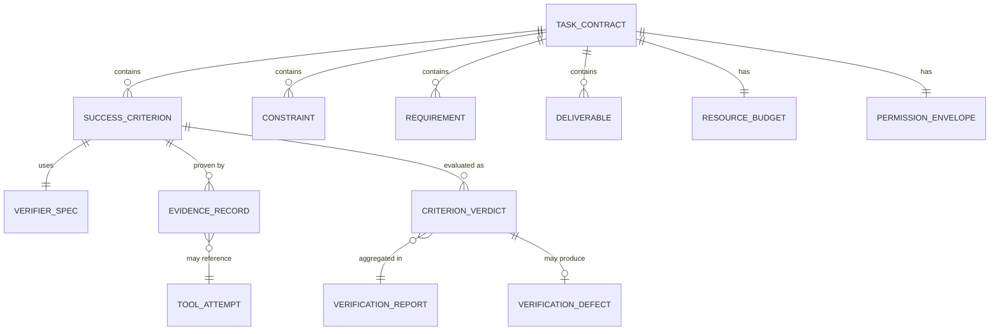
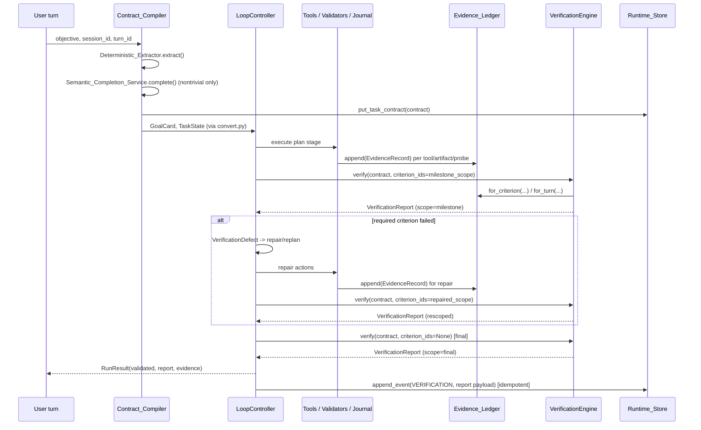

# Design Document: Kageha Reliability Spine

## Overview

Kageha currently decides task success through three independent paths that can
disagree: `runtime/validators.py` (`validate_result`, deterministic postcondition
checks run by `AgentRuntime._execute` *after* the controller returns),
`loop/verifier.py` (`verify_with_defects`, the semantic LLM verifier called once
per loop iteration inside `LoopController.run`), and `loop/verifier_agent.py`
(a standalone "enhanced verifier" module with its own deterministic checks that
is not wired into either of the other two paths in production). Concretely,
`AgentRuntime._execute` sets `result.validated = semantic_passed and
deterministic.deterministic_passed` — a second, independent AND of two
separately-computed booleans — which is exactly the split-path behavior
Requirement 15 (REL-033) requires removed.

The Reliability Spine replaces this with one pipeline:

1. **Contract_Compiler** turns the user's objective into a typed, versioned
   **TaskContract** (Requirements 5–7 / REL-010–012), combining a
   **Deterministic_Extractor** (regex/rule-based, no model call) with an
   optional **Semantic_Completion_Service** (planner-model structured
   completion) for nontrivial turns.
2. The TaskContract converts into the *existing* `GoalCard` and `TaskState` so
   every downstream consumer (controller loop, WebUI, CLI, events) keeps
   working unchanged (Requirement 1 / REL-010.6).
3. Tool execution, artifact validation, and browser/computer actions produce
   **EvidenceRecord** entries in an append-only **Evidence_Ledger**
   (Requirements 9–11 / REL-020–022), replacing raw string evidence as the
   source of truth (string evidence becomes a derived projection).
4. A single **VerificationEngine** is the sole authority that turns each
   `SuccessCriterion` into a `CriterionVerdict`, running deterministic
   postcondition checks, then artifact/function checks, then semantic
   judgment, in that fixed order (Requirement 12 / REL-030). It adapts
   `runtime/validators.py`, `loop/verifier.py`, and the deterministic checks
   in `loop/verifier_agent.py` behind one interface; the standalone
   enhanced-verifier *orchestration* is retired from production use.
5. `LoopController` runs verification at plan milestones and at claimed
   completion, turns failing required criteria into `VerificationDefect`
   objects fed into the existing repair/replan control path, and performs one
   final full verification before reporting success (Requirement 13 /
   REL-031). `AgentRuntime._execute` stops computing its own second pass/fail
   and instead consumes the controller's final `VerificationReport` directly
   (Requirement 13.6, 15.2 / REL-033).
6. `Runtime_Store` persists `TaskContract` and `EvidenceRecord` in two new,
   additive SQLite tables so existing sessions keep loading and new sessions
   gain durable contracts and evidence (Requirement 8, 9 / REL-013, REL-020).
7. `ApprovalGate` becomes fail-closed by construction — `LoopController` no
   longer silently installs the interactive CLI approver — and the CLI
   entrypoint becomes the only place that wires it in (Requirement 2 /
   REL-001).
8. The evaluation harness gains contract-aware manifest fields, a 30-task
   adversarial suite, and a `run`/`compare`/`inspect` CLI so false-success
   regressions are caught before release (Requirements 16–19 /
   REL-040–043).

This is a direct replacement (Requirement 1.9): there is no shadow
`VerificationEngine` running next to the old paths and no flag selecting
between them. Old code is either deleted, converted into a thin adapter that
delegates to the new engine, or (for the standalone enhanced-verifier module)
kept only as a source of reusable deterministic check functions.

## Architecture

```mermaid
flowchart TB
    subgraph Turn["Turn intake"]
        REQ[TurnRequest] --> CLASS{Trivial / lookup?}
    end

    CLASS -- yes --> LITE[Lightweight path\n(GoalCard.from_task template,\nno TaskContract)]
    CLASS -- no --> CC[Contract_Compiler]

    subgraph CC_inner["Contract_Compiler"]
        DE[Deterministic_Extractor] --> DRAFT[Draft TaskContract]
        DRAFT --> SC[Semantic_Completion_Service]
        SC --> FINAL[Final TaskContract]
    end
    CC --> CC_inner
    CC_inner --> CONV[convert.py:\nto_goal_card / to_task_state /\nto_deliverables]

    CONV --> GC[GoalCard]
    CONV --> TS[TaskState]
    FINAL --> PERSIST_C[(Runtime_Store:\ntask_contracts)]

    subgraph Loop["LoopController.run"]
        TS --> EXEC[Execute plan stage]
        EXEC --> TOOLS[Tools / validators / browser / research]
        TOOLS --> EVID[Evidence producers]
        EVID --> LEDGER[(Evidence_Ledger:\nevidence_records)]
        EXEC --> MILESTONE{Milestone reached\nor completion claimed?}
        MILESTONE -- yes --> VE[VerificationEngine.verify]
        VE --> REPORT[VerificationReport]
        REPORT --> DEFECTS{Required criterion\nfailed?}
        DEFECTS -- yes --> REPAIR[Repair / replan]
        REPAIR --> EXEC
        DEFECTS -- no --> DONE{All required\ncriteria pass?}
        DONE -- no --> EXEC
        DONE -- yes --> FINALV[Final full VerificationReport]
    end

    FINALV --> RR[RunResult\n(validated, report, evidence)]
    RR --> ENGINE[AgentRuntime._execute:\nconsume report only,\nno second pass/fail]
    ENGINE --> EVENTS[Runtime events:\naccepted/planned/verification/completed]
```

### Component boundaries and existing integration points

| New component | Lives in | Wraps / replaces | Existing integration point |
| --- | --- | --- | --- |
| `TaskContract` + element types | `kageha/contract/models.py` | `runtime/validators.compile_requirements()` dict, ad hoc goal templates | `GoalCard.from_task`, `TaskState.begin_turn` |
| `Deterministic_Extractor` | `kageha/contract/extractor.py` | regex logic in `validators.compile_requirements()` | called by `Contract_Compiler` |
| `Semantic_Completion_Service` | `kageha/contract/semantic.py` | none (new) | reuses `ModelRouter.chat(role="planning")` exactly like `loop/planner.py` |
| `Contract_Compiler` | `kageha/contract/compiler.py` | none (new orchestrator) | called from `LoopController.run` where `GoalCard`/`TaskState`/`compile_requirements()` are built today |
| `EvidenceRecord` / `Evidence_Ledger` | `kageha/verification/evidence.py` | string evidence fields (`RunResult.verification_evidence`, `TaskState.tool_results`) | `ToolJournal.after()`, `runtime/validators.py` validators, `verify_with_defects` |
| `VerificationEngine` | `kageha/verification/engine.py` | `validate_result()`, `verify_with_defects()`, `run_deterministic_verification()` | `LoopController.run` (milestone/completion calls), `AgentRuntime._execute` (final consumption only) |
| Additive `Runtime_Store` tables | `kageha/runtime/store.py` (`_ensure_schema`) | none (new tables) | existing `sessions`/`turns`/`events` tables, `SCHEMA_VERSION` |
| Fail-closed `ApprovalGate` wiring | `kageha/loop/controller.py`, `kageha/cli.py` | `LoopController.__init__`'s `approver or cli_approver` default | `ApprovalGate._ask()` (unchanged; already denies when `approver is None`) |
| Evaluation extensions | `kageha/eval/adversarial.py`, `kageha/eval/cli.py` | `eval/harness.py` (`GoldenTask`, `run_golden`) | `RuntimeStore.record_benchmark()` |

## Components and Interfaces

### TaskContract and element types (`kageha/contract/models.py`)

```python
class ConstraintSource(str, Enum):
    EXPLICIT = "explicit"        # verbatim in user text
    DETERMINISTIC = "deterministic"  # rule-extracted
    SEMANTIC = "semantic"         # planner-model inferred

class ContractStatus(str, Enum):
    ACTIVE = "active"
    UNRESOLVED = "unresolved"     # contradiction pending clarification

@dataclass(frozen=True)
class Constraint:
    id: str
    text: str
    source: ConstraintSource
    status: ContractStatus = ContractStatus.ACTIVE
    contradicts: tuple[str, ...] = ()   # ids of conflicting entries

class RequirementKind(str, Enum):
    FILE_COUNT = "file_count"
    FILENAME = "filename"
    SLIDE_COUNT = "slide_count"
    PAGE_COUNT = "page_count"
    DIMENSIONS = "dimensions"
    CITATION = "citation"
    TEST_COMMAND = "test_command"
    BROWSER_OUTCOME = "browser_outcome"
    PROHIBITION = "prohibition"

@dataclass(frozen=True)
class Requirement:
    id: str
    kind: RequirementKind
    value: Any
    source: ConstraintSource
    status: ContractStatus = ContractStatus.ACTIVE
    contradicts: tuple[str, ...] = ()

@dataclass(frozen=True)
class Deliverable:            # contract-level; converts to loop.task_state.Deliverable
    id: str
    description: str
    path_hint: str = ""
    required: bool = True

class VerifierKind(str, Enum):
    DETERMINISTIC_POSTCONDITION = "deterministic_postcondition"  # e.g. exit code, file exists
    ARTIFACT_CHECK = "artifact_check"        # validators.py registry
    SEMANTIC_JUDGMENT = "semantic_judgment"  # verify_with_defects-style LLM check

@dataclass(frozen=True)
class VerifierSpec:
    kind: VerifierKind
    config: dict[str, Any] = field(default_factory=dict)  # e.g. {"command": "pytest -q"}

@dataclass(frozen=True)
class SuccessCriterion:
    id: str
    required: bool
    description: str
    verifier: VerifierSpec
    depends_on: tuple[str, ...] = ()
    source: ConstraintSource = ConstraintSource.DETERMINISTIC

@dataclass(frozen=True)
class PermissionEnvelope:
    allowed_actions: tuple[str, ...] = ()
    denied_actions: tuple[str, ...] = ()
    default: Literal["deny", "allow"] = "deny"   # fail-closed default (REL-001)

@dataclass(frozen=True)
class ResourceBudget:
    max_steps: int
    max_usd: float
    max_time_s: float

@dataclass
class TaskContract:
    schema_version: int = 1
    contract_id: str = field(default_factory=lambda: uuid.uuid4().hex)
    session_id: str = ""
    turn_id: str = ""
    objective: str = ""
    constraints: list[Constraint] = field(default_factory=list)
    requirements: list[Requirement] = field(default_factory=list)
    deliverables: list[Deliverable] = field(default_factory=list)
    success_criteria: list[SuccessCriterion] = field(default_factory=list)
    permissions: PermissionEnvelope = field(default_factory=PermissionEnvelope)
    budget: ResourceBudget = field(default_factory=lambda: ResourceBudget(40, 2.0, 3600.0))
    compiler_source: str = "deterministic"  # deterministic | deterministic+semantic | deterministic_fallback
    created_at: float = field(default_factory=time.time)
```

`kageha/contract/convert.py` provides the compatibility bridge required by
REL-010.6 and REL-001.3:

```python
def to_goal_card(contract: TaskContract) -> GoalCard: ...
def to_task_state_deliverables(contract: TaskContract) -> list[Deliverable]: ...
def to_task_state_constraints(contract: TaskContract) -> list[str]: ...
```

`to_goal_card` maps each `SuccessCriterion` to one `GoalItem` (`id`,
`description`, `passes=False`), preserving today's `GoalCard.all_passed()` /
`progress()` / `to_markdown()` behavior unchanged — the controller loop does
not need to know a `TaskContract` exists.

### Contract_Compiler (`kageha/contract/compiler.py`)

```python
class ContractCompiler:
    def __init__(self, router: ModelRouter) -> None: ...

    async def compile(
        self, *, objective: str, session_id: str, turn_id: str,
        default_budget: ResourceBudget,
    ) -> TaskContract: ...
```

Compilation steps:

1. **Classification** — reuse the existing lookup/status heuristic
   (`loop/verifier.is_lookup_status_text`) plus a "trivial conversation"
   check. Trivial/lookup turns return `None` from `compile()`'s caller path
   (Requirement 1.8) — the controller keeps building `GoalCard.from_task()`
   directly, exactly as it does today.
2. **Deterministic extraction** — `Deterministic_Extractor.extract(objective)`
   returns `list[Requirement]` using the same regex families already in
   `runtime/validators.compile_requirements()` (slide/page counts, citations,
   browser outcome) extended with filename, dimensions, test-command, and
   explicit-prohibition patterns. Any two `Requirement` entries whose `kind`
   matches but whose `value` conflicts (e.g. two different exact slide
   counts) are both set to `status=UNRESOLVED` with `contradicts` populated;
   neither is dropped and neither is silently preferred (REL-011.3).
3. **Draft assembly** — deterministic `Requirement`/`Constraint` entries
   become `SuccessCriterion` entries with `source=DETERMINISTIC` and
   `VerifierSpec.kind=DETERMINISTIC_POSTCONDITION` or `ARTIFACT_CHECK`
   depending on kind (e.g. `test_command` → deterministic postcondition,
   `slide_count` → artifact check against the PPTX validator).
4. **Semantic completion** (skipped for trivial turns, REL-012.7) —
   `Semantic_Completion_Service.complete(draft, router)` sends the draft as
   structured output to the planner model (`role="planning"`, same pattern as
   `loop/planner.make_plan`) and merges the response:
   - Additive `SuccessCriterion`/`Constraint` entries with `source=SEMANTIC`
     are appended (REL-012.2).
   - Any returned mutation that deletes or weakens (e.g. flips
     `required=True → False`) an entry whose `source in {EXPLICIT,
     DETERMINISTIC}` is rejected — that single entry is dropped from the
     model's response, the rest of the response is still merged
     (REL-012.3, REL-012.6).
   - Each new entry's `id`, `depends_on` ids, `VerifierSpec.kind`
     availability, and any budget values are validated before acceptance;
     an individually invalid entry is dropped, not the whole response
     (REL-012.4, REL-012.6).
   - If the planner call raises or the response is not valid JSON matching
     the schema, `compile()` returns the deterministic draft unchanged with
     `compiler_source="deterministic_fallback"` — the turn is never blocked
     (REL-012.5).
5. **Budget resolution** — `ResourceBudget` is computed field-by-field as
   `min(default, requested)` when the request supplies a value, else the
   default (`config.max_steps()` / `config.max_usd()`), satisfying
   REL-010.4/5 with one rule instead of two.

Unresolved contradictions are never auto-resolved by any later step
(REL-011.4): the compiler and `VerificationEngine` both check
`status == UNRESOLVED` and treat matching criteria as `blocked`
(Requirement 14.2) until a new user turn contains explicit clarification text
that the extractor recognizes as resolving that specific `contradicts` pair —
at which point a fresh `Requirement` replaces both with `status=ACTIVE`.

`compile_requirements()` in `runtime/validators.py` is kept as a thin
compatibility adapter: it calls `Deterministic_Extractor.extract()` and
projects the result back into today's flat dict shape (`{"slides": int,
"citations": bool, ...}`) so any caller that still depends on the dict
contract keeps working (REL-011.2).

### Evidence_Ledger (`kageha/verification/evidence.py`)

```python
class EvidenceSource(str, Enum):
    COMMAND_OUTPUT = "command_output"
    ARTIFACT_DIGEST = "artifact_digest"
    BROWSER_PROBE = "browser_probe"
    COMPUTER_PROBE = "computer_probe"
    RESEARCH_RETRIEVAL = "research_retrieval"
    MODEL_JUDGMENT = "model_judgment"

class EvidenceCertainty(str, Enum):
    VERIFIED = "verified"       # reproducible probe confirms outcome
    PROBABLE = "probable"       # tool reported success, no independent probe
    UNVERIFIABLE = "unverifiable"
    STALE = "stale"             # from a prior turn, not re-confirmed this turn

@dataclass(frozen=True)
class EvidenceRecord:
    id: str
    session_id: str
    turn_id: str
    criterion_id: str
    tool_attempt_id: str = ""
    artifact_path: str = ""
    source: EvidenceSource
    source_ref: str            # command string, URL, artifact path, probe id
    timestamp: float
    digest: str                # sha256 of bounded content
    certainty: EvidenceCertainty
    producer: str               # e.g. "PythonValidator", "command_tool", "browser_probe"
    metadata: dict[str, Any] = field(default_factory=dict)
    probe: str = ""              # reproducible command/check, when available

class EvidenceLedger:
    def __init__(self, store: RuntimeStore) -> None: ...
    def append(self, record: EvidenceRecord) -> EvidenceRecord: ...   # redacts, then INSERTs
    def for_criterion(self, session_id: str, turn_id: str, criterion_id: str) -> list[EvidenceRecord]: ...
    def for_turn(self, session_id: str, turn_id: str) -> list[EvidenceRecord]: ...
```

`append()` runs every string field of the record through the existing
`kageha.obs.events.redact()` before the `INSERT` (REL-020.4) — no new
redaction logic is introduced; the same secret-pattern and memory-security
inspection already used for events and stored JSON blobs is reused here for
consistency. The table has no `UPDATE`/`DELETE` path in `RuntimeStore` — only
`append()` and read helpers exist, making the ledger immutable by
construction rather than by convention (REL-020.1).

Evidence producers wire into existing call sites, not new ones:

- **Artifact validators** (`runtime/validators.py`'s `FileValidator`,
  `PDFValidator`, `PowerPointValidator`, etc.) each gain a
  `to_evidence(check: ValidationCheck) -> EvidenceRecord` that captures a
  sha256 digest of the artifact and the structural fields already computed
  (page/slide counts, dimensions) (REL-021.1).
- **Command tools** — `ToolJournal.after()` (already computing `duration_ms`,
  `status`, `artifact_refs` from the tool result) gains an evidence hook that
  emits one `EvidenceRecord` per completed command-shaped tool call, carrying
  the command, the workspace-relative cwd, exit status, and a bounded digest
  of stdout/stderr (REL-021.2).
- **Browser/computer mutations** — a mutation is only convertible to an
  `EvidenceRecord` with `certainty=VERIFIED` when a post-action probe (a
  `computer_get_state`/`computer_screenshot`-shaped follow-up call, or a
  browser DOM/URL check) exists for the same `tool_attempt_id` chain; absent
  a probe the record is either not created or created with
  `certainty=UNVERIFIABLE`, which `VerificationEngine` never treats as proof
  (REL-021.3, REL-010.3 analog for browser tasks).
- **Research retrieval** (`research/backend.py`, `research/citations.py`)
  emits `EvidenceRecord(source=RESEARCH_RETRIEVAL, source_ref=url,
  metadata={"claim_id": ..., "retrieved_at": ...})` (REL-021.4).

Staleness (REL-020.3): `VerificationEngine` reads `EvidenceRecord.turn_id`
against the turn currently being verified. Any record from an earlier turn is
treated as `certainty=STALE` context unless a verifier stage explicitly
re-confirms it in the current turn (producing a fresh record referencing the
stale one via `metadata={"reconfirms": old_id}`) — this is the mechanism
behind Requirement 17.5's "stale prior-turn evidence" adversarial task.

Compatibility (Requirement 11): `RunResult.verification_evidence` and
`TaskState`'s tool-result notes are derived, at report-assembly time, from
`EvidenceLedger.for_turn()` — never populated from any other source — via a
pure `render_evidence_text(records: list[EvidenceRecord]) -> str` function
(REL-022.1). Event payloads gain an additive `evidence` array
(`[{"criterion_id", "source", "certainty", "digest"}, ...]`) alongside the
existing string fields (REL-022.3).

### VerificationEngine (`kageha/verification/engine.py`)

```python
class CriterionStatus(str, Enum):
    PASS = "pass"
    FAIL = "fail"
    BLOCKED = "blocked"       # unresolved contradiction / missing dependency
    UNRESOLVED = "unresolved"

@dataclass(frozen=True)
class VerificationDefect:
    criterion_id: str
    severity: Literal["critical", "major", "minor"]
    problem: str
    evidence_ids: tuple[str, ...] = ()
    repair_hint: str = ""
    stage: Literal["deterministic", "artifact", "semantic"] = "deterministic"

@dataclass(frozen=True)
class CriterionVerdict:
    criterion_id: str
    status: CriterionStatus
    stage_results: dict[str, Literal["pass", "fail", "skip_not_applicable"]]
    evidence_ids: tuple[str, ...] = ()
    defect: VerificationDefect | None = None

@dataclass(frozen=True)
class VerificationReport:
    report_id: str
    session_id: str
    turn_id: str
    scope: str                 # milestone:<id> | completion_claim | final
    verdicts: tuple[CriterionVerdict, ...]
    generated_at: float

    @property
    def success(self) -> bool:
        required = [v for v in self.verdicts if v.status != CriterionStatus.UNRESOLVED
                    or True]  # see Correctness Properties — success uses required-only rule
        ...

class Verifier(Protocol):
    kind: VerifierKind
    async def check(self, criterion: SuccessCriterion, ctx: VerificationContext) -> tuple[
        Literal["pass", "fail", "skip_not_applicable"], list[EvidenceRecord], VerificationDefect | None,
    ]: ...

class VerificationEngine:
    def __init__(self, ledger: EvidenceLedger, verifiers: dict[VerifierKind, Verifier]) -> None: ...

    async def verify(
        self, contract: TaskContract, *, criterion_ids: set[str] | None = None,
        ctx: VerificationContext,
    ) -> VerificationReport: ...
```

`criterion_ids=None` verifies every criterion (used for the completion-claim
and final passes); a non-`None` set scopes verification to a milestone's or a
targeted repair's criteria (Requirement 13.1, 13.4).

Three adapters implement `Verifier`, each wrapping existing logic without
rewriting it:

- `DeterministicPostconditionVerifier` wraps `verifier_agent.py`'s
  `check_files_exist` / `check_python_syntax` / `check_tests` / `check_lint`
  functions (the only part of the standalone enhanced-verifier module kept in
  production — its *orchestration* function `run_deterministic_verification`
  is not called anywhere; each `DeterministicCheck` function is called
  individually by this adapter instead) (REL-030.3).
- `ArtifactCheckVerifier` wraps `runtime/validators.ValidatorRegistry` —
  `validate_result()` becomes a thin adapter that calls
  `VerificationEngine.verify()` and reshapes the `VerificationReport` back
  into today's `VerificationResult` dataclass for any caller still using the
  old shape (REL-033.1).
- `SemanticJudgmentVerifier` wraps `loop/verifier.verify_with_defects` —
  unchanged prompt/logic, adapted to return a `CriterionVerdict` instead of a
  `VerifyResult`.

`verify()`'s per-criterion loop always runs all three stages in order and
requires each to produce a definitive (`pass`/`fail`, not merely
`skip_not_applicable` for every stage) result before assembling the verdict
(Requirement 12.4); when the deterministic stage is `fail`, the final
`status` is `FAIL` regardless of what `SemanticJudgmentVerifier` returns
(Requirement 12.5) — the loop does not short-circuit early, it always records
all three `stage_results` for observability, but precedence is fixed.

Tool-output acceptance (Requirement 10.5–10.6): each `Verifier.check()` call
returns an accept/reject stance on the evidence it used. When more than one
verifier stage examines the *same* `EvidenceRecord.id` and their stances
differ, `VerificationEngine` only treats that evidence as proof once the
number of accepting stages meets a configured threshold (default: majority of
stages that examined it); below threshold the criterion's status becomes
`UNRESOLVED` rather than `PASS`.

### LoopController integration (`kageha/loop/controller.py`)

`LoopController.run` changes at three call sites, replacing (not
wrapping) the current single `verify_with_defects` call:

1. **Milestone checkpoint** — when a `PlanStage` transitions to `DONE` and
   that stage's id maps to one or more `SuccessCriterion.depends_on`/scope,
   call `engine.verify(contract, criterion_ids=milestone_criteria, ctx=...)`
   (Requirement 13.1).
2. **Completion claim** — where the loop currently calls
   `verify_with_defects(goal, ...)` after `model_said_done`, call
   `engine.verify(contract, criterion_ids=None, ctx=...)` (all required
   criteria) instead (Requirement 13.2). Any `CriterionVerdict.defect` for a
   required, failed criterion is appended to `task_state.failures`/
   `Defect` exactly as `verify.snapshot.defects` is today, so the existing
   repair/replan control path (`ControlDecision.REPAIR` /
   `REPLAN_STAGE`) needs no change (Requirement 13.3).
3. **Post-repair re-check** — after a targeted repair, call `engine.verify`
   scoped to only the criteria the repair targeted (`criterion_ids={...}`),
   leaving other already-`PASS` verdicts in the running `VerificationReport`
   untouched (Requirement 13.4).
4. **Final verification** — immediately before `LoopController.run` returns
   `RunResult` with `status="success"`, one more `engine.verify(contract,
   criterion_ids=None, ...)` runs; `RunResult.validated` is set from
   *that* report's `.success`, not from `task_state.validated_ok()`
   (Requirement 13.5). `RunResult` gains `contract: TaskContract | None`,
   `evidence: tuple[EvidenceRecord, ...]`, and `report:
   VerificationReport | None` fields — additive, alongside the existing
   `validated`, `verification_evidence`, `verified_facts` fields
   (Requirement 1.4).

`AgentRuntime._execute` (`kageha/runtime/engine.py`) is simplified: the block
that currently calls `validate_result(...)` and computes `result.validated =
semantic_passed and deterministic.deterministic_passed` is deleted. Instead:

```python
result.validated = bool(result.report and result.report.success)
```

The `VERIFICATION` event emitted after the controller returns is populated
from `result.report` (criteria/defects/evidence ids) instead of from a
freshly recomputed `deterministic` result — this is the concrete fix for
Requirement 15.2/13.6 ("consume the LoopController's final VerificationReport
instead of performing a second authoritative validation").

Idempotent replay (Requirement 15.3): `VERIFICATION`/`VERIFICATION_STARTED`
events already go through `RuntimeStore.append_event`, whose `events` table
has `UNIQUE(idempotency_key)`. Verification event idempotency keys are
derived from the `VerificationReport.report_id` (itself deterministic per
`(turn_id, scope, criterion_ids)` rather than random), so replaying or
resuming a turn that already emitted a report for a given scope raises the
existing `sqlite3.IntegrityError` → is caught and skipped by
`append_event`'s existing idempotent-insert handling, exactly like tool
events today.

### Fail-closed ApprovalGate wiring (`kageha/loop/controller.py`, `kageha/cli.py`)

Today `LoopController.__init__` sets `self.approver = approver or
cli_approver` — every construction without an explicit `approver` (including
test construction, the eval harness, and any future non-CLI caller) silently
installs the interactive CLI approver. This line changes to:

```python
self.approver = approver  # None unless explicitly supplied — fail closed by default
```

`ApprovalGate._ask()` already returns `ApprovalOutcome(False)` (audited as
`denied_no_approver`) when `self.approver is None` — no change needed there.
This makes REL-001.1/1.3 hold structurally: any `LoopController()` built
without an approver denies mutating tool calls instead of prompting.

The CLI entrypoint becomes the only place that installs `cli_approver`:
`kageha/cli.py`'s one-shot path and `kageha/chat/repl.py`'s interactive path
both pass `approver=cli_approver` explicitly into their `TurnRequest`/
`durable.execute(...)` calls when the session is interactive (REL-001.2). The
WebUI path already builds its own `_make_web_approver` and passes it
explicitly — unaffected. The eval harness and test construction, which today
accidentally get `cli_approver`, now correctly fail closed unless a test
supplies its own approver or `auto_approve=True` (REL-001.6).

### Evaluation harness extensions (`kageha/eval/`)

```python
@dataclass
class AdversarialTask:
    id: str
    category: Literal["coding", "artifact", "browser", "research", "lifecycle"]
    prompt: str
    false_success_trap: str            # human-readable description of the trap
    contract_criteria: list[dict[str, Any]] = field(default_factory=list)
    fixtures: dict[str, Any] = field(default_factory=dict)
    forbidden_actions: list[str] = field(default_factory=list)
    expected_terminal_state: str = "success"
    max_cost: float = 0.5
    max_steps: int = 20
    max_time_s: float = 300.0
    repeat: int = 3                    # REL-042.1 — exactly 3, enforced by the runner

ADVERSARIAL_REPEAT_COUNT = 3            # runner never exceeds this regardless of task.repeat

@dataclass
class AdversarialRunResult:
    task_id: str
    run_index: int
    outcome: Literal["verified_success", "false_success", "unresolved", "recovered"]
    cost_usd: float
    latency_s: float
    steps: int
    tool_calls: int

def run_environment() -> dict[str, Any]:
    """model id, harness config hash, uv.lock digest, platform, git commit."""
```

`GoldenTask` (`eval/harness.py`) gains the same additive optional fields used
by `AdversarialTask` (`contract_criteria`, `fixtures`, `forbidden_actions`,
`expected_terminal_state`, `max_time_s`, `repeat=1` default) without changing
any existing field or `load_goldens()`'s JSON shape for files that omit them
(Requirement 16.1, 16.3).

The 30-task suite lives at `kageha/eval/adversarial_tasks/{coding,artifact,
browser,research,lifecycle}.json`, six tasks per file, each with a non-empty
`false_success_trap` (Requirement 17). `run_adversarial_suite()` calls
`run_golden`-equivalent logic exactly `ADVERSARIAL_REPEAT_COUNT` times per
task regardless of `task.repeat`, storing each run via
`RuntimeStore.record_benchmark(suite="adversarial", ...)` and one aggregate
summary per task (Requirement 18.1, 18.3).

`Evaluation_CLI` — a new Typer sub-app mounted from `kageha/cli.py` as
`kageha eval run|compare|inspect`:

- `run [--suite golden|adversarial] [--repeat N]` executes the suite and
  stores results.
- `compare <run_id_a> <run_id_b>` diffs pass rates and false-success counts
  between two stored benchmark runs.
- `inspect <run_id>` prints per-task reasons, evidence digests, and cost.

## Data Models



### Persistence — additive `Runtime_Store` tables

`RuntimeStore._ensure_schema()` bumps `SCHEMA_VERSION` from `1` to `2`. The
existing "rebuild when version diverges" branch only ever fires when the
on-disk version is `0` (pre-1.0 development databases); real upgrades from a
released `SCHEMA_VERSION=1` database now take a dedicated, non-destructive
path:

```python
if version == 1:
    self._conn.executescript(
        """
        BEGIN IMMEDIATE;
        CREATE TABLE IF NOT EXISTS task_contracts (
            id TEXT PRIMARY KEY,
            session_id TEXT NOT NULL,
            turn_id TEXT NOT NULL,
            schema_version INTEGER NOT NULL,
            contract_json TEXT NOT NULL,
            created_at REAL NOT NULL,
            UNIQUE(session_id, turn_id)
        );
        CREATE TABLE IF NOT EXISTS evidence_records (
            id TEXT PRIMARY KEY,
            session_id TEXT NOT NULL,
            turn_id TEXT NOT NULL,
            criterion_id TEXT NOT NULL,
            tool_attempt_id TEXT NOT NULL,
            artifact_path TEXT NOT NULL,
            source TEXT NOT NULL,
            source_ref TEXT NOT NULL,
            certainty TEXT NOT NULL,
            producer TEXT NOT NULL,
            digest TEXT NOT NULL,
            probe TEXT NOT NULL,
            metadata_json TEXT NOT NULL,
            created_at REAL NOT NULL
        );
        CREATE INDEX IF NOT EXISTS evidence_records_criterion
            ON evidence_records(session_id, turn_id, criterion_id);
        PRAGMA user_version=2;
        COMMIT;
        """
    )
    version = 2
```

This satisfies REL-013.1 ("keyed by session ID and turn ID using additive
table creation"), REL-013.4 and REL-051.1 ("migrate that database
automatically through additive table creation") without touching `sessions`,
`turns`, `events`, or any other existing table. A session created before this
milestone simply has no row in `task_contracts` for its turns; `RuntimeStore`
treats a missing contract row as "no contract" rather than an error, so
`get_snapshot`/`rebuild`/session listing continue to work unchanged
(Requirement 1.5). Loading such a session and finding its `events`/`turns`
JSON blobs unparsable (a *corrupted*, not merely *contract-less*, session)
still raises — `RuntimeStore` does not attempt partial recovery there
(Requirement 1.6); this is existing `json.JSONDecodeError`-propagates
behavior in `_row_event`/`get_snapshot`, unchanged by this milestone.

`RuntimeStore` gains:

```python
def put_task_contract(self, contract: TaskContract) -> None: ...
def get_task_contract(self, session_id: str, turn_id: str) -> TaskContract | None: ...
def append_evidence(self, record: EvidenceRecord) -> None: ...
def evidence_for_turn(self, session_id: str, turn_id: str) -> list[EvidenceRecord]: ...
```

`VerificationReport` is *not* given its own table. It is carried inside the
existing `events` table via the existing `VERIFICATION_STARTED`/
`VERIFICATION` event kinds, with an additive `report` payload field
(`{"scope", "verdicts": [...], "success"}`) — this reuses the existing
idempotent-event-insert mechanism for Requirement 15.3 for free and avoids a
third additive table beyond what REL-013/REL-020 explicitly require.

## Correctness Properties

*A property is a characteristic or behavior that should hold true across all
valid executions of a system — essentially, a formal statement about what the
system should do. Properties serve as the bridge between human-readable
specifications and machine-verifiable correctness guarantees.*

### Property 1: Contract-to-GoalCard/TaskState conversion is structure-preserving

*For any* `TaskContract` with an arbitrary mix of required and optional
`SuccessCriterion` entries, converting it to a `GoalCard` produces exactly one
`GoalItem` per criterion with matching id and description, and converting it
to `TaskState` fields produces deliverables/constraints consistent with the
contract's own `Deliverable`/`Constraint` entries.

**Validates: Requirements 1.3, 5.6**

### Property 2: Additive payload fields never remove existing fields

*For any* `RunResult` or runtime event payload produced under the new spine,
every field present in the pre-migration shape (`validated`,
`verification_evidence`, `verified_facts`, event `kind`/`payload` keys) is
still present and unchanged in meaning, while `contract`, `evidence`, and
`report` appear only as additional fields.

**Validates: Requirements 1.4, 8.2, 11.3**

### Property 3: Trivial/lookup classification skips both contract compilation and the planner call

*For any* objective text classified as trivial conversation or a simple
read-only lookup, `Contract_Compiler.compile()` neither produces a full
`TaskContract` nor invokes the `Semantic_Completion_Service`'s planner call;
for any objective classified as nontrivial and executable, both are attempted.

**Validates: Requirements 1.8, 7.7**

### Property 4: A contract-less session's next executable turn always compiles a contract first

*For any* session whose most recent turn has no persisted `TaskContract` and
whose next turn is executable (non-trivial), a `TaskContract` exists for that
next turn before its execution phase begins.

**Validates: Requirements 1.7**

### Property 5: Mutating tool calls fail closed by default, regardless of construction path

*For any* `LoopController` constructed without an explicit `approver`, and
for any mutating `Computer_Tool` request made through the resulting
`ApprovalGate` with `auto_approve=False`, the gate returns `DENIED` before the
driver is reached — this holds independent of how or where the controller was
constructed (production wiring or test construction).

**Validates: Requirements 2.1, 2.3**

### Property 6: An explicitly injected approver always overrides the interactive default

*For any* approver object explicitly passed into `LoopController`, the
`ApprovalGate` built for that controller uses that object — never
`cli_approver` — for every approval decision in that run.

**Validates: Requirements 2.4**

### Property 7: Allowlisted actions are approved regardless of other approval state

*For any* action whose allowlist key matches an existing allowlist entry,
`ApprovalGate.require()` returns approved regardless of `auto_approve` value
or whether an approver is configured.

**Validates: Requirements 2.5**

### Property 8: The stdin guard fails immediately absent a prior interactive prompt

*For any* sequence of test operations in which a stdin read is attempted
before any interactive prompt has occurred in that test, the guard raises a
failure at the point of that read rather than blocking.

**Validates: Requirements 3.2**

### Property 9: TaskContract structural invariants hold for any mix of required/optional criteria

*For any* constructed `TaskContract`, `schema_version == 1`; required and
optional `SuccessCriterion` entries coexist in the same `success_criteria`
list; and every entry's id, status, description, `VerifierSpec`, and
`depends_on` tuple survive contract construction and JSON round-trip
unchanged.

**Validates: Requirements 5.1, 5.2**

### Property 10: Constraint.source correctly tags its creation path

*For any* `Constraint` produced by explicit user text, by the
`Deterministic_Extractor`, or by the `Semantic_Completion_Service`, its
`source` field equals `EXPLICIT`, `DETERMINISTIC`, or `SEMANTIC` respectively.

**Validates: Requirements 5.3**

### Property 11: ResourceBudget always resolves to the stricter of default and requested, per field

*For any* default `ResourceBudget` and any optionally-supplied requested
budget values, the resolved `ResourceBudget`'s `max_steps`, `max_usd`, and
`max_time_s` each equal `min(default, requested)` when requested is supplied
for that field, and the default otherwise.

**Validates: Requirements 5.4, 5.5**

### Property 12: Deterministic extraction recovers every supported Requirement type from matching text

*For any* request text constructed to embed one or more of: a file count, a
filename, a slide/page count, dimensions, a citation marker, a test command,
a browser-outcome phrase, or an explicit prohibition, `Deterministic_Extractor
.extract()` returns a `Requirement` of the matching `RequirementKind` with a
value recovered from the embedded text.

**Validates: Requirements 6.1**

### Property 13: compile_requirements() preserves its pre-migration dict shape

*For any* objective text, the compatibility adapter `compile_requirements()`
returns a dict whose keys are a subset of `{"slides", "pdf_pages",
"minimum_artifacts", "citations", "browser_outcome"}` with the same value
types as before the migration, derived from the same `Deterministic_Extractor`
result used to build the full `TaskContract`.

**Validates: Requirements 6.2**

### Property 14: Contradictory explicit requirements are marked unresolved and stay unresolved absent clarification

*For any* pair of explicit `Requirement` entries whose `kind` matches and
whose `value` conflicts, both are marked `status=UNRESOLVED` with mutual
`contradicts` references rather than one being silently dropped or preferred;
*for any* sequence of subsequent compiler or controller steps that does not
include an explicit user-clarification event referencing that pair, both
entries remain `UNRESOLVED`.

**Validates: Requirements 6.3, 6.4**

### Property 15: Semantic completion is additive and selectively validated

*For any* deterministic draft contract and any planner-model response: (a)
additive `SuccessCriterion`/`Constraint` entries that reference valid ids,
valid dependency ids, an available `VerifierKind`, and valid budget values are
merged into the result; (b) any single entry that would delete or weaken an
`EXPLICIT`- or `DETERMINISTIC`-sourced entry, or that has an invalid id,
dependency id, verifier kind, or budget value, is rejected on its own without
discarding any other valid entry from the same response or falling back to
the deterministic-only contract.

**Validates: Requirements 7.2, 7.3, 7.4, 7.6**

### Property 16: Planner failure or invalid schema falls back without blocking

*For any* simulated `Semantic_Completion_Service` failure (planner call
raises, or the response is not valid JSON matching the expected schema),
`Contract_Compiler.compile()` returns the deterministic draft contract
unchanged with `compiler_source="deterministic_fallback"`, and does not raise.

**Validates: Requirements 7.5**

### Property 17: TaskContract persistence round-trips by session and turn, including through replay/resume

*For any* `TaskContract` persisted via `put_task_contract`, reading it back
via `get_task_contract(session_id, turn_id)` — whether immediately, or after
a simulated session replay/resume — returns a contract equal to the one
persisted.

**Validates: Requirements 8.1, 8.3**

### Property 18: Evidence ledger entries round-trip by their linking keys and are never mutated

*For any* `EvidenceRecord` appended via `EvidenceLedger.append()`, reading it
back via `for_criterion`/`for_turn` returns a record equal to the one
appended (after redaction); appending a second record with the same id is
rejected rather than overwriting the first.

**Validates: Requirements 9.1**

### Property 19: Evidence from a different turn is never treated as fresh proof without explicit re-confirmation

*For any* `EvidenceRecord` whose `turn_id` differs from the turn currently
being verified, and absent a fresh record in the current turn whose
`metadata.reconfirms` references it, `VerificationEngine` treats it with
`certainty=STALE` and never uses it alone to produce a `PASS` verdict.

**Validates: Requirements 9.3**

### Property 20: Secret-shaped substrings are redacted before persistence

*For any* `EvidenceRecord` whose `source_ref`, `metadata`, or `probe` fields
contain a secret-shaped substring (API key, bearer token, password pattern),
the persisted record has that substring replaced with a redaction marker in
every affected field.

**Validates: Requirements 9.4**

### Property 21: Each evidence producer populates the fields required for its source type

*For any* artifact processed by a validator, the resulting `EvidenceRecord`
carries a content digest and structural metadata matching the artifact; *for
any* command execution, the record carries the exact command, working
directory, exit status, and a bounded output digest; *for any* browser or
computer mutation lacking a post-action probe, no record with
`certainty=VERIFIED` is produced for it; *for any* research retrieval, the
record carries the retrieved URL, a retrieval timestamp, and a claim
association.

**Validates: Requirements 10.1, 10.2, 10.3, 10.4**

### Property 22: Verifier acceptance of tool output requires quorum, and rejected output alone is never sufficient

*For any* tool output examined by more than one verifier stage, that output
is treated as proof for a criterion only when the number of accepting stages
meets or exceeds the configured acceptance threshold; *for any* tool output
that every examining verifier stage rejects, no criterion is marked `PASS` on
the basis of that output alone.

**Validates: Requirements 10.5, 10.6**

### Property 23: Legacy string evidence is a pure projection of the EvidenceRecord set

*For any* two turns with equal `EvidenceRecord` sets, the derived legacy
string evidence field is identical for both; *for any* two turns whose
`EvidenceRecord` sets differ, the derived strings differ accordingly (no
other input contributes to that field).

**Validates: Requirements 11.1**

### Property 24: Adapting a legacy check preserves its original outcome

*For any* input previously handled directly by `validate_result()`,
`verify_with_defects()`, or one of `verifier_agent.py`'s `check_*` functions,
routing the same input through the corresponding `VerificationEngine`
adapter produces the same pass/fail determination as the original function
call.

**Validates: Requirements 12.2, 15.1**

### Property 25: All three verification stages always run, in order, with fixed precedence

*For any* `SuccessCriterion` evaluated by `VerificationEngine.verify()`, all
three stages (deterministic postcondition, artifact/function check, semantic
judgment) produce a definitive `stage_results` entry regardless of any
earlier stage's outcome; *for any* criterion where the deterministic stage
result is `fail`, the criterion's final `status` is `FAIL` even when the
semantic judgment stage independently returns `pass`.

**Validates: Requirements 12.4, 12.5**

### Property 26: Milestone verification is scoped exactly to that milestone's criteria

*For any* plan milestone mapped to a subset of `SuccessCriterion` ids,
reaching that milestone produces a `VerificationReport` whose verdicts cover
exactly that subset — no more, no fewer.

**Validates: Requirements 13.1**

### Property 27: A completion claim always verifies the full required-criteria set

*For any* `TaskContract` and any point at which the executor claims
completion, the resulting `VerificationReport`'s verdicts cover every
`required=True` `SuccessCriterion`, never a strict subset.

**Validates: Requirements 13.2**

### Property 28: Every failing required criterion produces a defect fed to the repair path

*For any* `VerificationReport` containing a required criterion with
`status=FAIL`, a corresponding `VerificationDefect` exists and is present in
the set handed to the controller's repair/replan control path.

**Validates: Requirements 13.3**

### Property 29: Targeted repair re-verification touches exactly the repaired criteria

*For any* repair scoped to a subset of criterion ids, the verification run
immediately after that repair produces verdicts for exactly that subset,
leaving every other criterion's most recent verdict in the running report
unchanged.

**Validates: Requirements 13.4**

### Property 30: Reporting completion always follows a fresh final full verification

*For any* run that reports `status="success"`, a `VerificationReport` with
`scope="final"` covering every required `SuccessCriterion` was generated
immediately before that report, and `RunResult.validated` is derived from
that report.

**Validates: Requirements 13.5**

### Property 31: The runtime's validated outcome always equals the controller's final report outcome

*For any* `RunResult` returned by `LoopController.run` carrying a final
`VerificationReport`, `AgentRuntime._execute`'s resulting `validated` value
equals that report's `.success` value — it is never recomputed from an
independent deterministic pass.

**Validates: Requirements 13.6, 15.2**

### Property 32: Completion semantics — success iff every required criterion passes with accepted evidence

*For any* `VerificationReport`, the task is successful if and only if every
`required=True` criterion has `status=PASS` backed by at least one accepted
`EvidenceRecord`; *for any* report where an optional criterion fails while all
required criteria pass, that failure is included in the final response
without excluding the task from success; *for any* report where a required
criterion is `UNRESOLVED`, its effective status for the success determination
is treated as not-passing (`BLOCKED`/`FAIL`), excluding the task from success.

**Validates: Requirements 14.1, 14.2, 14.3**

### Property 33: Unresolvable contradictions escalate, and undeliverable escalation degrades to a warning

*For any* requirement contradiction that cannot be safely auto-resolved, the
engine produces a user-escalation request; *for any* such escalation whose
delivery is simulated to fail, the controller continues the run and the
final response contains a warning note rather than halting silently.

**Validates: Requirements 14.4, 14.5**

### Property 34: Budget exhaustion always preserves partial artifacts and never reports success

*For any* run whose `ResourceBudget` is exhausted mid-execution with one or
more artifacts already written to the workspace, those artifacts remain
present on disk after the run ends, and the reported status is not
`"success"`.

**Validates: Requirements 14.6**

### Property 35: Replay/resume never duplicates or drops verification events

*For any* sequence of verification events produced by a clean run, replaying
or resuming that session one or more additional times produces a persisted
`events` table whose verification-kind rows (by idempotency key) are
identical in count and content to the single clean run.

**Validates: Requirements 15.3**

### Property 36: Manifest parsing round-trips all contract-aware fields

*For any* manifest dict containing `contract_criteria`, `fixtures`,
`forbidden_actions`, `expected_terminal_state`, `max_cost`, `max_steps`,
`max_time_s`, and `repeat`, parsing it into a `GoldenTask`/`AdversarialTask`
and re-serializing it reproduces the same field values.

**Validates: Requirements 16.1**

### Property 37: The adversarial runner executes exactly three iterations per task/configuration

*For any* `AdversarialTask` and configuration, `run_adversarial_suite()`
invokes the underlying run exactly `ADVERSARIAL_REPEAT_COUNT` (3) times and no
more, regardless of the task's own `repeat` field or of individual run
outcomes.

**Validates: Requirements 18.1**

### Property 38: Every recorded run populates all required outcome fields

*For any* completed adversarial or golden run, the stored `AdversarialRunResult`/
`EvalResult`-equivalent has non-null values for outcome classification, cost,
latency, steps, and tool-call count.

**Validates: Requirements 18.2**

### Property 39: Benchmark storage round-trips individual and aggregate results

*For any* set of run results recorded via `RuntimeStore.record_benchmark()`,
reading back the stored rows for that suite reproduces the same
configuration, environment, metrics, and status for each run, and the
aggregate summary computed from them matches a summary computed directly
from the original in-memory results.

**Validates: Requirements 18.3**

## Sequence: contract → evidence → verification → repair



## Error Handling

| Failure | Handling |
| --- | --- |
| Planner model call fails or returns invalid schema during semantic completion | `Contract_Compiler` catches the exception/validation error, logs it, and returns the deterministic draft with `compiler_source="deterministic_fallback"`. The turn proceeds (REL-012.5). |
| A single semantic addition is individually invalid (bad id, unavailable verifier, bad budget value) | Only that entry is dropped from the merge; the rest of the response and the deterministic draft are unaffected (REL-012.6). |
| Two explicit requirements contradict | Both marked `UNRESOLVED`; `VerificationEngine` treats their criteria as `BLOCKED`, and the controller escalates to the user (Requirement 14.4) rather than guessing. If escalation delivery fails, the run continues with a warning appended to the final response (Requirement 14.5). |
| `Runtime_Store` opens a database at `SCHEMA_VERSION=1` | Additive `CREATE TABLE IF NOT EXISTS` migration runs once, bumping `user_version` to `2`; no data in existing tables is touched. |
| `Runtime_Store` opens a database whose `events`/`turns` JSON is corrupted (not just missing contract rows) | Existing behavior is preserved: the read raises rather than returning partial data; the caller must recreate the session (Requirement 1.6). |
| Evidence producer cannot compute a probe (e.g. browser mutation with no follow-up state check) | An `EvidenceRecord` is either not emitted or emitted with `certainty=UNVERIFIABLE`; `VerificationEngine` never treats `UNVERIFIABLE` evidence as sufficient proof on its own (Requirement 10.3, 10.5). |
| Verifier stages disagree on whether a tool output is proof | Engine applies the configured acceptance threshold (default majority); below threshold the criterion is `UNRESOLVED`, not silently `PASS` (Requirement 10.6). |
| ResourceBudget exhausted mid-run | `LoopController` stops issuing new actions, keeps all artifacts already written to the workspace, and reports a non-`"success"` status (Requirement 14.6). |
| Mutating tool call arrives with `auto_approve=False` and no approver | `ApprovalGate` denies before the driver is invoked; this is enforced structurally by `LoopController` no longer defaulting to `cli_approver` (Requirement 2.1, 2.3). |
| Replay/resume re-emits an already-persisted verification event | `RuntimeStore.append_event`'s existing `UNIQUE(idempotency_key)` constraint causes the duplicate insert to be caught and skipped, exactly as tool-attempt events are handled today (Requirement 15.3). |
| Old pre-milestone session is resumed for its next turn | `Contract_Compiler` compiles a `TaskContract` for that turn before execution proceeds, even though earlier turns in the same session have none (Requirement 1.7). |

## Testing Strategy

**Unit tests** focus on specific examples, edge cases, and integration
points that property tests are not well suited for:

- Loading an intact pre-milestone session (no `task_contracts` rows) succeeds
  end to end (Requirement 1.5).
- Loading a session whose stored JSON is corrupted fails closed and requires
  re-creation (Requirement 1.6).
- The CLI entrypoint installs `cli_approver`; the WebUI and eval-harness
  entrypoints do not (Requirement 2.2).
- The additive-migration script run against a fixed pre-milestone
  `runtime.db` fixture produces the two new tables without altering existing
  rows (Requirement 8.4, 21.1).
- `Full_Qualification_Command` records a skipped test and its required
  environment when a test is skipped (Requirement 4.4).
- The fixed content of the 30-task adversarial suite: exactly six tasks per
  category, each with a non-empty `false_success_trap` (Requirement 17.1–17.6).
- `Evaluation_CLI`'s `run`, `compare`, `inspect` subcommands exist and parse
  their arguments correctly (Requirement 18.4).
- `record_benchmark`'s five required environment fields (model id, harness
  config, dependency lock digest, platform, commit) are populated for one
  representative run (Requirement 16.2).
- `load_goldens()` still parses today's golden JSON fixture files unchanged
  (Requirement 16.3).

**Property tests** (Hypothesis, ≥100 examples per property) cover the
universal behaviors in the Correctness Properties section above — contract
compilation, conversion, semantic completion merging, evidence recording and
staleness, verifier precedence and quorum, completion semantics, budget
exhaustion, and idempotent replay. Each property test:

- Lives under `tests/property/test_<area>.py` (e.g.
  `test_contract_compiler.py`, `test_evidence_ledger.py`,
  `test_verification_engine.py`, `test_loop_controller_verification.py`,
  `test_approval_gate.py`, `test_adversarial_harness.py`).
- Is tagged with a comment referencing its design property, e.g.:
  `# Feature: kageha-reliability-spine, Property 14: Contradictory explicit
  requirements are marked unresolved and stay unresolved absent clarification`.
- Runs with `@settings(max_examples=100)` at minimum (Hypothesis default
  profile raised for CI).
- Uses mocks for the planner model (`ModelRouter.chat`), the browser/computer
  driver, and network calls (research retrieval, citation reachability) so
  100+ iterations stay fast and free of live-provider cost — matching how
  `tests/test_computer_regression.py` and `tests/test_router_risk.py`
  already mock drivers/approvers today.
- For persistence properties (17, 18, 39), uses a temporary SQLite file per
  test via `RuntimeStore(path=tmp_path / "runtime.db")`, mirroring the
  existing `default_runtime_db()` pattern.

**Property-to-test mapping** (partial, illustrative):

| Property | Generator sketch |
| --- | --- |
| 11 (budget resolution) | `st.tuples(st.integers(), st.floats(), st.floats())` for defaults and optional requested overrides, including `None` (no override) per field |
| 14 (contradiction handling) | Pairs of `Requirement` with same `kind`, generated conflicting `value`s (e.g. two distinct integers for `SLIDE_COUNT`), plus random non-clarifying follow-up turns |
| 22 (verifier quorum) | Generated `list[Literal["accept","reject"]]` per evidence id plus a random threshold, checking the accept/reject boundary |
| 25 (stage precedence) | Generated `(deterministic_result, artifact_result, semantic_result)` triples across `{pass, fail}`, asserting all three appear in `stage_results` and final status follows precedence |
| 32 (completion semantics) | Generated `VerificationReport`s with random required/optional criteria in random pass/fail/unresolved/evidence-present combinations |
| 37 (exactly-3 repeats) | Generated task/configuration pairs with a counting mock runner, asserting call count == 3 for any `task.repeat` value including 1, 3, 10 |

This dual approach keeps unit tests small and specific while property tests
carry the burden of exploring the input space for the rules that must hold
universally — consistent with the existing test suite's split between
targeted regression tests (`tests/test_computer_regression.py`,
`tests/test_router_risk.py`) and the broader `tests/test_runtime*.py`
coverage-gated suite.

## Migration and Backward-Compatibility Strategy

1. **Database**: additive-only. `SCHEMA_VERSION` moves `1 → 2`; the new
   migration path only ever adds `task_contracts` and `evidence_records`
   (plus one index) via `CREATE TABLE IF NOT EXISTS`. No existing table,
   column, or row is altered or dropped. The pre-existing "wipe on
   unexpected version" branch continues to guard only pre-1.0 databases
   (`version not in (0, SCHEMA_VERSION)` with `version == 0` triggering
   rebuild) — a `1 → 2` upgrade never enters that branch.
2. **Old sessions without contracts**: `get_task_contract()` returning
   `None` is a normal, expected state for every turn recorded before this
   milestone. `LoopController` treats "no contract for the current turn" as
   "compile one now" (Property 4) rather than as an error. Turns recorded
   before this milestone are never retroactively compiled.
3. **Event shape**: `accepted`/`planned`/`verification` events gain
   additive payload keys only (`contract_summary`, `evidence`, `report`).
   Existing consumers (WebUI, CLI renderers, `tests/test_runtime*.py`) that
   read today's keys are unaffected; nothing is renamed or removed
   (Requirement 11.2, 20.3 background).
4. **RunResult / GoalCard / TaskState**: all three keep every existing field
   and method. `RunResult` gains three new optional fields; `GoalCard` and
   `TaskState` are populated *from* the contract via `convert.py` but their
   own shapes do not change, so any code constructing or reading them
   directly (skills, subagents, WebUI) needs no changes.
5. **compile_requirements()**: preserved verbatim as a compatibility
   adapter with the same dict-shaped return value (Property 13).
6. **verify_with_defects() / validate_result() / run_deterministic_verification()**:
   `verify_with_defects` and `validate_result` become thin adapters that
   delegate to `VerificationEngine` and reshape the result back to their
   original return types, so any direct caller keeps compiling and behaving
   the same for inputs it previously handled (Property 24).
   `run_deterministic_verification` (the enhanced-verifier orchestration
   function) is not called by production code after this milestone; its
   individual `check_*` functions remain importable and are reused by
   `DeterministicPostconditionVerifier`.
7. **ApprovalGate default change**: this is the one intentionally
   *behavior-changing* migration step — any caller that relied on
   `LoopController()` implicitly installing `cli_approver` will now see
   `DENIED` instead of an interactive prompt unless it explicitly passes an
   approver or `auto_approve=True`. This is called out in the Migration
   Guide (Requirement 21) as a required action for operators embedding
   `LoopController` directly outside the CLI/WebUI/eval entrypoints that
   this design updates.
8. **Rollback**: because migration is additive-only, downgrading the code
   while keeping the database is safe — old code simply ignores the two new
   tables. Rolling back the code after new tables have data loses only the
   contract/evidence history for turns run under the new code; no existing
   table is put at risk either direction.
